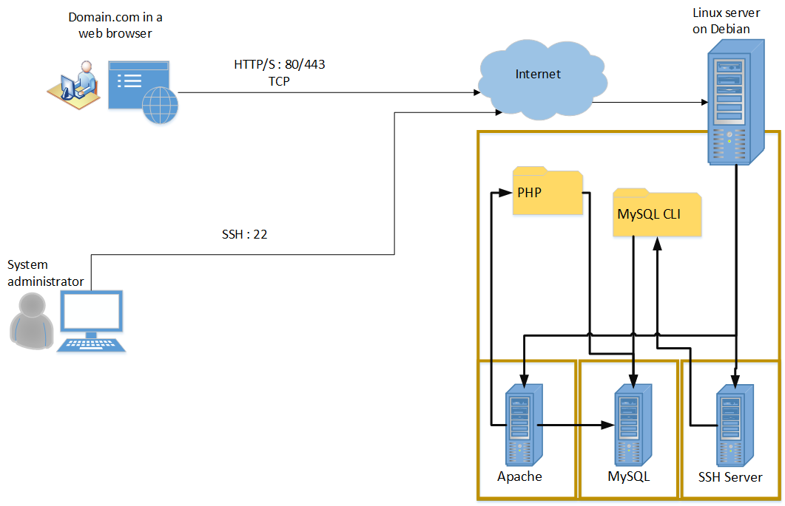
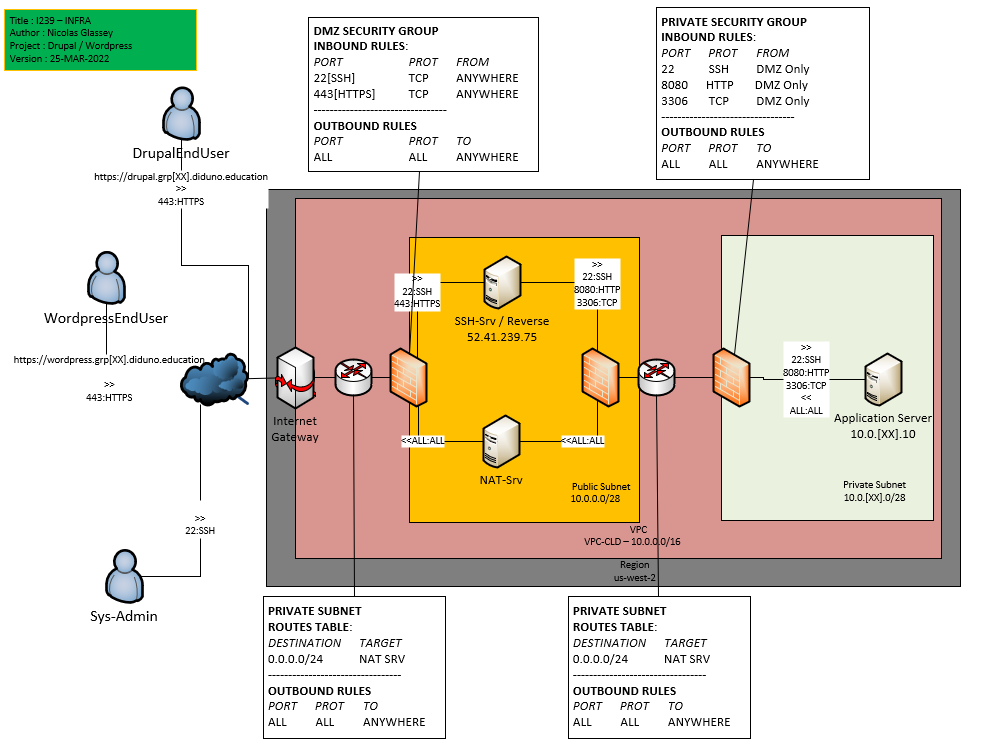

# ICT-239 notes
All notes I have taken during this course and finished in April 2022.

- [ICT-239 notes](#ict-239-notes)
- [General advice](#general-advice)
- [General goal](#general-goal)
	- [Packages](#packages)
	- [Services](#services)
- [Local training infrastructure](#local-training-infrastructure)
	- [Integrity check of Debian Bullseye ISO image](#integrity-check-of-debian-bullseye-iso-image)
	- [Work without sudo](#work-without-sudo)
	- [General settings](#general-settings)
		- [Network settings](#network-settings)
		- [Adding 2 folders to $PATH](#adding-2-folders-to-path)
		- [Mirror settings](#mirror-settings)
	- [Creating the admin user](#creating-the-admin-user)
		- [Set language to English](#set-language-to-english)
		- [Install sudo](#install-sudo)
	- [SSH](#ssh)
		- [Install the SSH server](#install-the-ssh-server)
		- [Disable root login via SSH](#disable-root-login-via-ssh)
		- [SSH Connection](#ssh-connection)
		- [SSH login](#ssh-login)
	- [Managing services on Linux](#managing-services-on-linux)
- [Remote infrastructure on AWS](#remote-infrastructure-on-aws)
	- [Infrastructure](#infrastructure)
	- [Install PHP 8.0 and MariaDB](#install-php-80-and-mariadb)
	- [Setup users and database](#setup-users-and-database)
	- [PHP installation](#php-installation)
	- [Additionnal tools if needed](#additionnal-tools-if-needed)
	- [Get results stats](#get-results-stats)
	- [Configure VHosts](#configure-vhosts)
		- [Setup the vhosts via the default config file](#setup-the-vhosts-via-the-default-config-file)
		- [Setup the vhosts via separated config files](#setup-the-vhosts-via-separated-config-files)
	- [File uploads](#file-uploads)
		- [Easy way: graphical interface](#easy-way-graphical-interface)
		- [Hard way: via command line](#hard-way-via-command-line)
	- [Apps](#apps)
	- [Drupal](#drupal)
		- [Enable extensions required for Drupal](#enable-extensions-required-for-drupal)
		- [Drupal setup](#drupal-setup)

# General advice
- Before installing or using a package, just understand what is does and why we use it. Just have a quick look at the man page for this package.
- Read error messages carefully
- Some CLI tools are not directly accessible because /sbin is not present in PATH
- A service produces all the time logs so we need to look at them when we have errors or to check we don't have.
- After installing a service, we can make sure it's running (and enabled, to make sure it restarts at each machine restart). The command for this: `systemctl status ssh` (ssh is the name of the service here). We can check the port and protocole too. Contrary to Windows, we have a big visibility of what happens, so let's take advantage of it. 
- Never use the machine with the `root` account more than just to setup the `admin` user (member of sudoers and has root like rights but with the sudo barrier).
- No matter if we are in a local VM or on AWS, we can do frequent snapshots, it's okay to break things and restore to the last working state, even in cloud systems.

# General goal
On our VM Debian Bullseye 11.2 Setup a web server with multiples websites with the following things installed and basically configured:

## Packages
- PHP v8.1
- MySQL CLI

## Services
- Apache: as web server
- MySQL: to manage databases
- SSH Server: to manage the server remotly

# Local training infrastructure
The VM runs in VMWare 16.1.0.


## Integrity check of Debian Bullseye ISO image

The iso file `debian-11.2.0-amd64-netinst.iso` comes from [this mirror](https://ftp.acc.umu.se/debian-cd/current/amd64/iso-cd/). The hashsum in SHA512 [found here](https://ftp.acc.umu.se/debian-cd/current/amd64/iso-cd/SHA512SUMS) is `c685b85cf9f248633ba3cd2b9f9e781fa03225587e0c332aef2063f6877a1f0622f56d44cf0690087b0ca36883147ecb5593e3da6f965968402cdbdf12f6dd74`

With the following Powershell command, you can get the hash in SHA512 of the file:

`Get-FileHash .\debian-11.2.0-amd64-netinst.iso -Algorithm SHA512  | select Hash`

## Work without sudo

## General settings
### Network settings
Put the VM on VMNet0, that is configured to have to `Connect the host virtual adapter to this network` and `Use local DHCP Service to distribute IP address to VMs`. And with the subnet `192.168.88.0`. Network configuration of the VM (to see the IP assigned via DHCP) is viewable writing `ip a`.

### Adding 2 folders to $PATH
`export PATH=$PATH:/usr/sbin`  
`export PATH=$PATH:/sbin`

Now when you do `echo $PATH` you should see the 2 new folders at the end that were not present before.

### Mirror settings
To set the mirror where packages will be downloaded: `nano /etc/apt/sources.list`

Then insert this line: `deb https://debian.ethz.ch/debian bullseye main contrib non-free`. Notice the `bullseye` which is the name of Debian 11, to make sure we have the packages for this version of Debian. It's important to have a mirror which is geographically near. (bullseye = debian 11th version name)

Then `apt-get update && apt-get upgrade` to update the repository and our distribution. It's important to always run it before installing anything.

## Creating the admin user
We have `cpnv` and `root`, but we need to create a second admin account that can install packages but cannot break everything like the root account.

Create the user: `sudo /sbin/adduser admin` and enter a password. (Append `--disabled-password` if no password need to be disabled)

Granting rights to `admin`: 
```bash
usermod -aG sudo admin #Change user account "admin" and append it to Group named "sudo"
sudo visudo
```
Add: `apacheadmin ALL=(ALL) NOPASSWD:ALL`.
You can now use the `admin` user by default for the administration and never use `root` again.


### Set language to English
Help: [“bash: dpkg-reconfigure: command not found” in Debian 10 Buster](https://medium.com/the-blog-of-ehsan-nazim/bash-dpkg-reconfigure-command-not-found-in-debian-10-buster-b5c89ae84a75)

`export LANG=en_GB.UTF-8`  
`export LANGUAGE=en_GB:en`

Then run `dpkg-reconfigure locales` (utility is in `usr/sbin` so the environment variable $PATH need to be configured with this folder) and a blue interface will popup and you will be able to set language to en GB. Then restart your machine.

### Install sudo
- Open session as `root`: `su root`.
- `apt-get install sudo`
- Exit from the root session: `exit`.

## SSH
### Install the SSH server
- `apt-get install openssh-server` and choose Continue.
- `systemctl status ssh` will show you the status of the ssh service. It need to be active and enabled to be used.

### Disable root login via SSH
To disable login with root via SSH, you can modify `/etc/ssh/sshd_config` and change `PermitRootLogin` to `no`.

### SSH Connection

**Create a SSH key pair**:  
On your physical machine (or the one you use to connect remotely). Use Cmder.
- Go in the folder where you want to store your keys
- Run `ssh-keygen`
- Rename file to `id_rsa_239` (this will place the keys in your current folder)
- You will then see at least `id_rsa_239` (private key) and `id_rsa_239.pub`.

**Add the public key to the authorized keys list for a given account**:

//go the the user home folder as admin
sudo su - <new_user>

//create .ssh folder with adapted rights
mkdir .ssh
chmod 700 .ssh

//create authorized_keys with adapted rights
touch .ssh/authorized_keys
chmod 600 .ssh/authorized_keys

//add public key
nano .ssh/authorized_keys

### SSH login
`ssh -i yourprivatekeyfile username@ipadresse`

## Managing services on Linux

These 2 commands do the same things.

```
sudo service apache2 start
sudo systemctl start apache2
```

# Remote infrastructure on AWS
This shows the full procedure to setup a remote web server with 2 websites.


## Infrastructure
- Setup SSH and HTTP tunnels
	`ssh samuel@52.41.239.75 -L 23:10.0.90.19:22  -L 8080:10.0.02.10:8080 -i I239_SAMUEL_PUBLIC_SSH.pem`

## Install PHP 8.0 and MariaDB

```shell
# Setup
sudo apt install wget
sudo apt update
sudo apt -y upgrade

# Apache installation
sudo apt install apache2

# Change default port to 8080
sudo nano /etc/apache2/ports.conf
# Change "Listen 80" to "Listen 8080"

# Restart apache service
sudo systemctl restart apache2

# MariaDB installation
sudo apt install mariadb-server -y
# secure the install
sudo mysql_secure_installation
# enter a root password and Enter to all following questions
```

Apache logs are in `/var/log/apache2/access.log`. Default website root folder is `/var/www/html`.

## Setup users and database
This is SQL script to run manually after login with `mysql -u root -p`. We would like to create an SQL user reachable only on localhost. (If you want to make it connectable from whatever machine, just use %: 'myuser'@'%').
```sql
/*Create database*/
CREATE DATABASE i239;

/*Create myuser connectable on localhost with password myuser, with all privileges on database i239*/
CREATE USER 'myuser'@'localhost' IDENTIFIED BY 'myuser';
GRANT ALL PRIVILEGES on i239.* to 'myuser'@'localhost';

FLUSH PRIVILEGES;

/*Show results */
SHOW GRANTS FOR 'myuser'@'localhost';
SELECT `user`, `host`, IF(LENGTH(password)>0, password, authentication_string) AS `password` FROM `mysql`.`user`;"
```

## PHP installation
```shell
sudo apt update
sudo apt install -y lsb-release ca-certificates apt-transport-https software-properties-common gnupg2
echo "deb https://packages.sury.org/php/ $(lsb_release -sc) main" | sudo tee /etc/apt/sources.list.d/sury-php.list
wget -qO - https://packages.sury.org/php/apt.gpg | sudo apt-key add -
sudo apt update
yes | sudo apt install php8.0

# Create info page to test the configuration
cd /var/www/html
sudo chmod 777 /var/www/html
sudo echo "<?php phpinfo(); ?>" > info.php

# Final test, visit /info.php page with curl and your browser
sudo apt install curl
curl localhost:8080

```

## Additionnal tools if needed
- composer
- git

```shell
# Composer install 
sudo wget -O composer-setup.php https://getcomposer.org/installer

#Setup composer
sudo php composer-setup.php --install-dir=/usr/local/bin --filename=composer
rm composer-setup.php

#Git install
sudo apt install git
```

## Get results stats
```
systemctl status mariadb
php -v
git --version
```

## Configure VHosts
Here, I explain 2 ways to setup the virtual hosts (vhosts).

### Setup the vhosts via the default config file
```
cd /etc/apache2/sites-available
sudo nano 000-default.conf
```

Add the new vhosts at the end of the file:

`<VirtualHost *:8080>` means to listen locally on port 8080 (the running port of Apache2)

```
<VirtualHost *:8080>
ServerName monsite1.ch
DocumentRoot /var/www/site1
</VirtualHost>

<VirtualHost *:8080>
ServerName monsite2.ch
DocumentRoot /var/www/site2
</VirtualHost>
```

```
sudo a2ensite 000-default
sudo systemctl reload apache2
```

### Setup the vhosts via separated config files

You can create one separated config files per website but I find this more difficult to manage.

For a new website `monsite1.ch`, create a new file in `/etc/apache2/sites-available`. As you can see ServerName and DocumentRoot are specific to our website. `<VirtualHost *:8080>` means to listen locally on port 8080 (the running port of Apache2 in our case). 

```
<VirtualHost *:8080>
ServerName monsite1.ch
DocumentRoot /var/www/site1
</VirtualHost>
```

Everytime you change a configuration file, you need to reload apache: `sudo systemctl reload apache2`.

```shell
## 3 useful commands you should know.

## Enable the website for the first time
sudo a2ensite monsite1.ch

## Disable the website if you need.
sudo a2dissite monsite1.ch

## Reloading apache reloads the configuration of all websites
sudo systemctl reload apache2
```

## File uploads
### Easy way: graphical interface
- Use filezilla with a SFTP connection using:
    - hostname: localhost
    - port: 23
    - identity file: your key file in PEM format (or PPK)

### Hard way: via command line
TODO: finish document this with rsync
<!-- commandes en cours.
NOT WORKING !

envoi des fichiers dans partagex login template folder.

rsync * -e 'ssh -i C:\Users\samuel.roland\.ssh\vm239' admin@192.168.88.128:/var/www/html/ -r --rsync-path="sudo rsync"

ssh admin@192.168.88.128

-->


----
Advanced part...

## Apps
drupal requirements
php 7.3
mariadb 10.3.7
apache 2.4.7

wordpress
php 7.4
mariadb 10.2

installé
apache 2.4.52
7.4

## Drupal
This is an NOT WORKING attempt to install Drupal.

### Enable extensions required for Drupal
```shell
sudo chmod 777 /etc/php/8.0/cli/php.ini
yes | sudo apt install unzip
yes | sudo apt install php8.0-dom
yes | sudo apt install php8.0-gd
yes | sudo apt install php8.0-zip
yes | sudo apt install php8.0-pdo-mysql

sudo echo "extension=dom" >> /etc/php/8.0/cli/php.ini
sudo echo "extension=zip" >> /etc/php/8.0/cli/php.ini
sudo echo "extension=pdo_mysql" >> /etc/php/8.0/cli/php.ini
sudo echo "extension=openssl" >> /etc/php/8.0/cli/php.ini
sudo echo "extension=curl" >> /etc/php/8.0/cli/php.ini
sudo echo "extension=sodium" >> /etc/php/8.0/cli/php.ini
sudo chmod 744 /etc/php/8.0/cli/php.ini
```

### Drupal setup
```
composer create-project drupal/recommended-project /var/www/drupal
```
