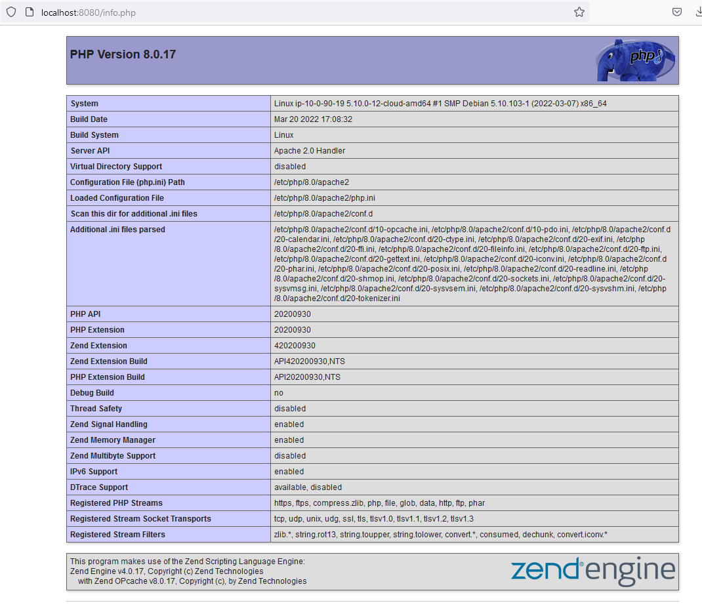

# I239 - DOcumentation technique

## Story 001 - Config Apache

```
curl localhost:8080 

<!DOCTYPE html PUBLIC "-//W3C//DTD XHTML 1.0 Transitional//EN" "http://www.w3.org/TR/xhtml1/DTD/xhtml1-transitional.dtd">
<html xmlns="http://www.w3.org/1999/xhtml">
  <head>
    <meta http-equiv="Content-Type" content="text/html; charset=UTF-8" />
    <title>Apache2 Debian Default Page: It works</title>
    <style type="text/css" media="screen">
  * {
    margin: 0px 0px 0px 0px;
    padding: 0px 0px 0px 0px;
  }

[...]

```

## Story 002 - SSH User

```
ssh myuser@localhost -p 23 -i myuserkey

Linux ip-10-0-90-19 5.10.0-12-cloud-amd64 #1 SMP Debian 5.10.103-1 (2022-03-07) x86_64

The programs included with the Debian GNU/Linux system are free software;
the exact distribution terms for each program are described in the
individual files in /usr/share/doc/*/copyright.

Debian GNU/Linux comes with ABSOLUTELY NO WARRANTY, to the extent
permitted by applicable law.
Last login: Fri Apr  1 07:06:16 2022 from 10.0.0.11
myuser@ip-10-0-90-19:~$ whoami
myuser
myuser@ip-10-0-90-19:~$
```

## Story 003 - MySql

```shell
# login as root with password root
mysql -u root -p

# then
show databases;
+--------------------+
| Database           |
+--------------------+
| i239               |
| information_schema |
| mysql              |
| performance_schema |
+--------------------+
4 rows in set (0.000 sec)

```

```shell
# login as myuser with password root
mysql -u root -p

# then
SELECT `user`, `host`, IF(LENGTH(password)>0, password, authentication_string) AS `password` FROM `mysql`.`user`;
+-------------+-----------+-------------------------------------------+
| User        | Host      | password                                  |
+-------------+-----------+-------------------------------------------+
| mariadb.sys | localhost |                                           |
| root        | localhost | *81F5E21E35407D884A6CD4A731AEBFB6AF209E1B |
| mysql       | localhost | invalid                                   |
| myuser      | localhost | *CBA73BBE5D9AF59311C3F4D7E8C20AA847F7B188 |
+-------------+-----------+-------------------------------------------+
4 rows in set (0.001 sec)
# The user myuser exists and is accessible only in localhost

```

```shell
# login as myuser with password myuser
mysql -u myuser -p

# then
show databases;

+--------------------+
| Database           |
+--------------------+
| i239               |
| information_schema |
+--------------------+
2 rows in set (0.000 sec)
# The user only access the database i239

```

## Story 004 - Php

Visite de http://localhost:8080/info.php




## Story 005 - Vhost

Visite de http://monsite1.ch:888/
Visite de http://monsite2.ch:888/


